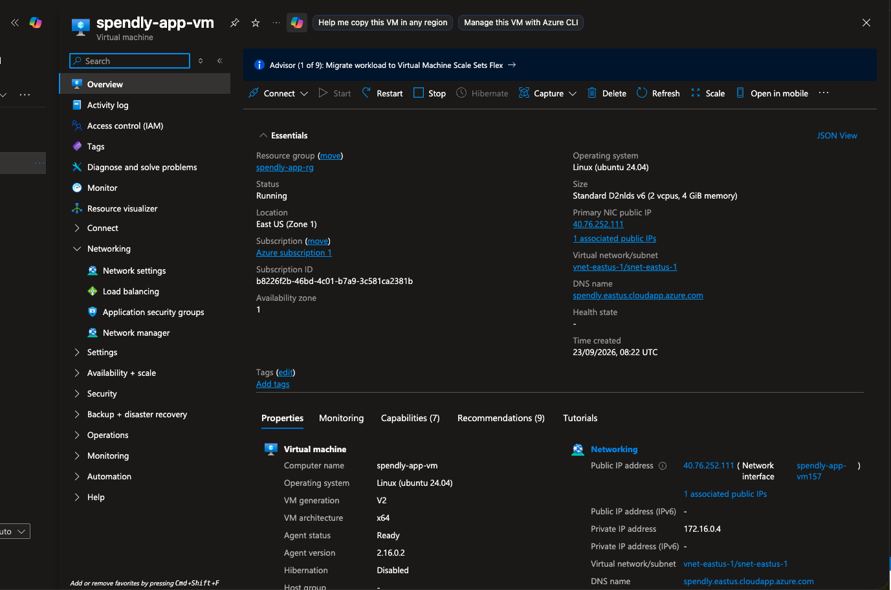
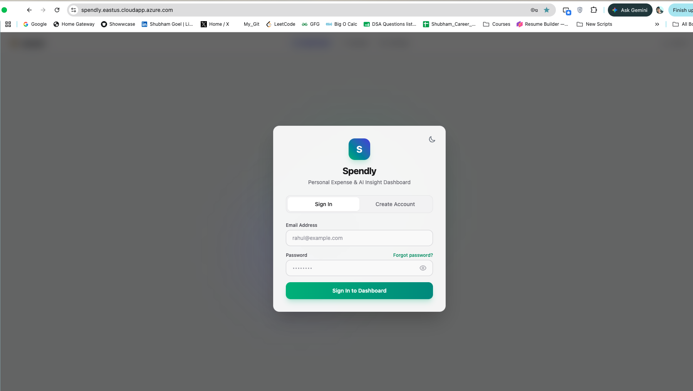
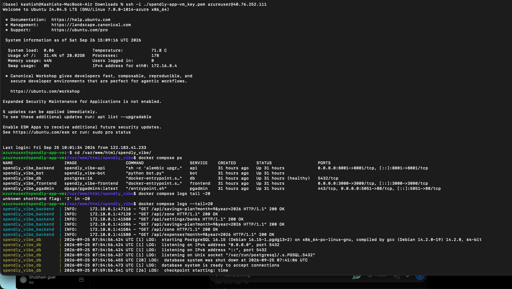
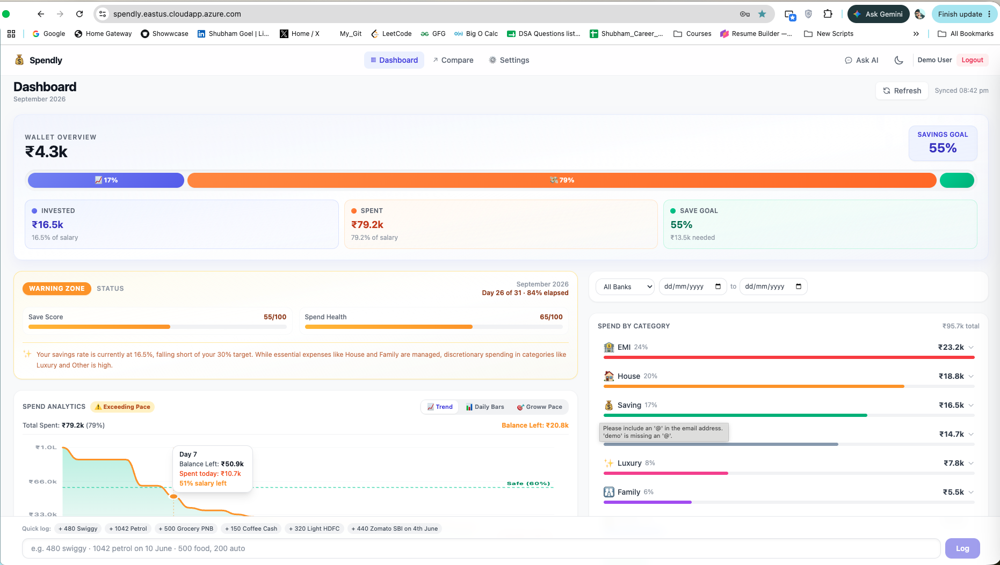
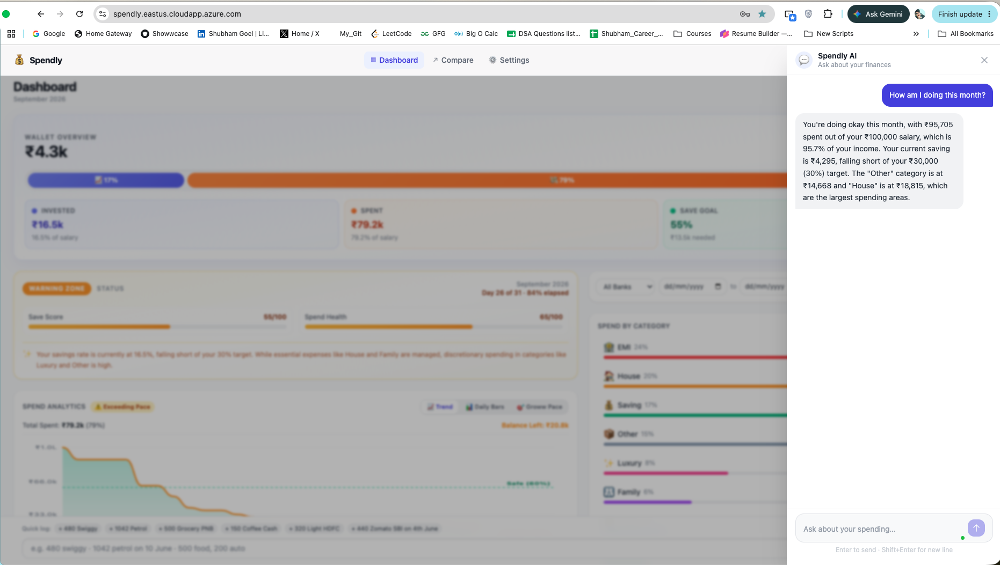
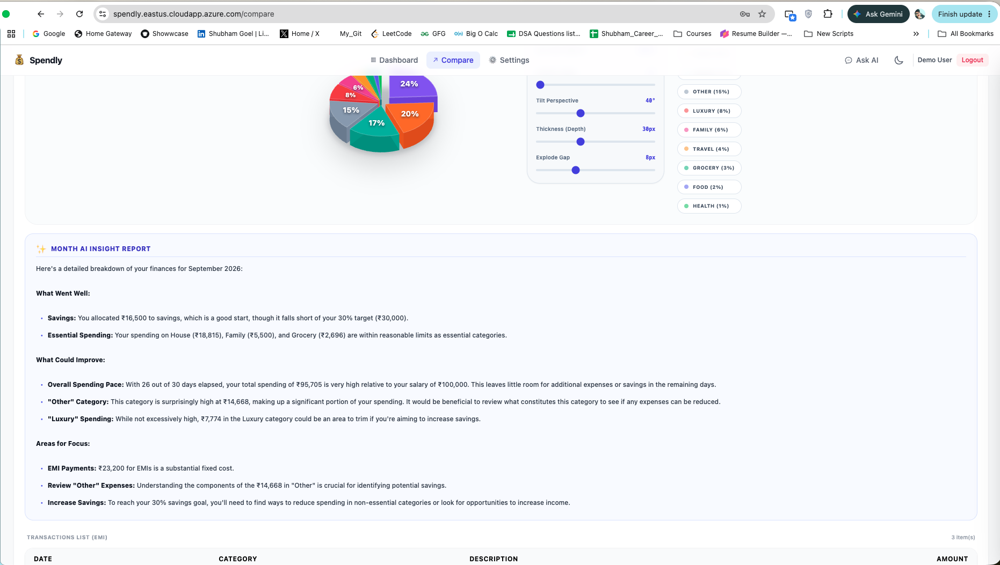
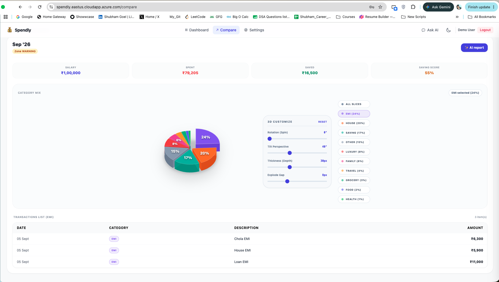

# Spendly

> AI-powered personal expense management application built with FastAPI, PostgreSQL, TypeScript and Gemini APIs, containerized with Docker and deployed on an Azure Virtual Machine.

Spendly is a full-stack application designed to simplify expense management by combining a modern TypeScript frontend with a FastAPI backend and AI-powered capabilities through Google's Gemini APIs.

The application is built as a containerized multi-service system and was deployed to an **Azure Linux Virtual Machine**, with **Nginx** acting as the reverse proxy and **Docker Compose** managing the application services.

---

## 🚀 Project Overview

Spendly provides a full-stack environment for managing expenses while experimenting with AI-assisted functionality.

### Core Technologies

| Layer            | Technology         |
| ---------------- | ------------------ |
| Frontend         | TypeScript, npm    |
| Backend          | Python, FastAPI    |
| Database         | PostgreSQL         |
| AI Integration   | Google Gemini APIs |
| Reverse Proxy    | Nginx              |
| Containerization | Docker             |
| Orchestration    | Docker Compose     |
| Cloud            | Microsoft Azure VM |

---

## 🏗️ Architecture

```text
                         Internet
                            │
                            ▼
                    ┌───────────────┐
                    │  Azure VM     │
                    │               │
                    │    Nginx      │
                    │ Reverse Proxy │
                    └───────┬───────┘
                            │
                 ┌──────────┴──────────┐
                 │                     │
                 ▼                     ▼
        ┌─────────────────┐   ┌─────────────────┐
        │   Frontend      │   │    FastAPI      │
        │   TypeScript    │   │    Backend      │
        │   npm           │   │                 │
        └─────────────────┘   └────────┬────────┘
                                       │
                         ┌─────────────┴─────────────┐
                         │                           │
                         ▼                           ▼
                ┌─────────────────┐        ┌─────────────────┐
                │   PostgreSQL    │        │  Gemini APIs    │
                │    Database     │        │   AI Services   │
                └─────────────────┘        └─────────────────┘
```

### Request Flow

```text
Client
   │
   ▼
Azure VM Public Endpoint
   │
   ▼
Nginx
   │
   ├──► Frontend container
   │
   └──► FastAPI container
             │
             ├──► PostgreSQL
             │
             └──► Gemini API
```

---

# ☁️ Azure Deployment

Spendly was deployed to a **Microsoft Azure Virtual Machine** rather than being run only on a local development environment.

The Azure VM hosts the Dockerized application stack and provides the external network entry point for the application.

### Deployment Stack

```text
Azure Virtual Machine
        │
        ▼
      Nginx
        │
        ▼
 Docker Compose
        │
 ┌──────┼───────────────┐
 │      │               │
 ▼      ▼               ▼
Frontend Backend     PostgreSQL
         │
         ▼
    Gemini APIs
```

The application services are started using:

```bash
docker compose up -d
```

Nginx is configured as the reverse proxy in front of the application services.

---

# 📸 Deployment Evidence

The screenshots included in this repository were captured from the application running on the Azure VM deployment.

They are included to demonstrate that the application shown in the documentation is not merely a localhost development environment.

### Azure VM



The Azure portal screenshot identifies the Virtual Machine used to host the Spendly deployment.

### Running Application



The Spendly application shown above was accessed through the Azure-hosted deployment.

### Containerized Services



The Docker services running on the Azure VM demonstrate the containerized deployment environment.

### API



FastAPI backend running as part of the Docker Compose deployment.

### AI Capabilities

 and 

The Spendly application uses Gemini AI for AI-powered functionality.

### Expense Comparison



The Compare Expense section compares monthly expenses and gives insights.
---

# 🐳 Docker Deployment

The complete application is containerized to provide a reproducible deployment environment.

Docker Compose is used to manage the application services.

Typical deployment:

```bash
git clone <repository-url>

cd spendly

docker compose up -d
```

Check running containers:

```bash
docker compose ps
```

View logs:

```bash
docker compose logs
```

Stop the application:

```bash
docker compose down
```

---

# 🔀 Nginx Reverse Proxy

Nginx sits in front of the application services and acts as the reverse proxy.

```text
                    Client
                      │
                      ▼
                    Nginx
                      │
              ┌───────┴───────┐
              │               │
              ▼               ▼
          Frontend         FastAPI
```

This allows the application to expose a single public entry point while internally routing requests to the appropriate Docker services.

---

# 🤖 AI Integration

Spendly integrates Google's Gemini APIs for AI-powered functionality.

```text
User Request
     │
     ▼
FastAPI Backend
     │
     ▼
AI Service Layer
     │
     ▼
Gemini API
     │
     ▼
AI Response
     │
     ▼
FastAPI
     │
     ▼
Frontend
```

The Gemini API is accessed from the backend rather than exposing API credentials directly to the frontend.

> API keys and other secrets are intentionally excluded from the repository.

---

# 🗄️ Database

PostgreSQL is used as the primary relational database.

The database runs as part of the Dockerized application environment.

Application services communicate with PostgreSQL through the internal Docker network rather than exposing the database directly to the public internet.

---

# 💻 Local Development

The application can also be reproduced locally using Docker Compose.

### Prerequisites

* Docker
* Docker Compose
* Git

Clone the repository:

```bash
git clone <repository-url>
cd spendly
```

Create the required environment configuration:

```bash
cp .env.example .env
```

Configure the required environment variables.

Start the application:

```bash
docker compose up -d
```

Check the services:

```bash
docker compose ps
```

---

# 🔐 Environment Variables

Sensitive credentials are not committed to the repository.

Examples include:

```text
DATABASE_URL
GEMINI_API_KEY
SECRET_KEY
```

Use `.env.example` as the template for required configuration.

---

# 📂 Repository Structure

```text
spendly/
│
├── backend/
│   ├── app/
│   └── ...
│
├── frontend/
│   ├── src/
│   └── ...
│
├── screenshots/
│   ├── azure-vm.png
│   ├── application.png
│   ├── docker-containers.png
│   └── application-dashboard.png
│
├── docs/
│   └── AZURE_DEPLOYMENT.md
│
├── docker-compose.yml
├── .env.example
└── README.md
```

> The exact directory structure may differ depending on the current implementation.

---

# ☁️ Deployment Documentation

For the complete Azure deployment process, see:

**[Azure Deployment Guide](docs/AZURE_DEPLOYMENT.md)**

The guide covers:

* Azure VM setup
* VM networking
* Docker installation
* Docker Compose deployment
* Environment configuration
* Nginx reverse proxy
* Application verification
* Deployment evidence

---

# 🎯 Engineering Highlights

Spendly demonstrates experience with:

* Designing REST APIs using FastAPI
* PostgreSQL-backed application development
* AI integration using Gemini APIs
* TypeScript frontend development
* Docker containerization
* Multi-container orchestration with Docker Compose
* Nginx reverse proxy configuration
* Azure VM deployment
* Environment and secret management
* Separation of frontend, backend and database services
* Deploying a full-stack application to a cloud environment

---

# 📌 Deployment Status

The Azure VM is used as the cloud deployment environment for this project.

The VM may be **deallocated when the application is not actively being demonstrated** in order to avoid unnecessary cloud compute costs.

The source code, architecture, deployment configuration and deployment evidence remain available in this repository.

This means the project can be reproduced on an Azure VM without requiring the original VM to remain continuously active.

---
